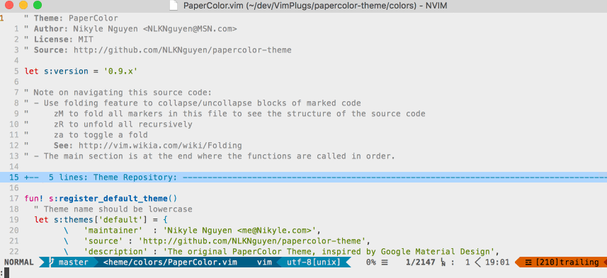

# ⚡ bolt.nvim

⚡ Fuzzy finder file manager for Neovim with emphasis on speed and visibility

_"Get that Total Commander filter-as-you-type fast paced navigation in vim"_



## Installation

**Note:** bolt.nvim requires Neovim(latest is recommended) with Python3 enabled.
See [requirements](#requirements) if you aren't sure whether you have this.

For vim-plug:

```vim

call plug#begin()

Plug 'philip-karlsson/bolt.nvim', { 'do': ':UpdateRemotePlugins' }

call plug#end()
```

## Requirements
bolt.nvim requires Neovim with Python3.
tIf `:echo has("python3")` returns `1`, then you have python 3 support; otherwise, see below.

You can enable the Neovim Python3 interface with pip:

    pip3 install neovim

### TODOs:
- [ ] Split source in to several files
- [ ] Populate README.md with keybindings
- [ ] Add support for two panes
- [ ] Add colors
- [ ] Add support cd/cp/mv/
- [ ] Add support for searching using e.g. RipGrep

## Thanks
Thanks for trying out this plugin, any feedback/contrubution would be much appreciated as
this is my first take on writing plugins for Neovim.
